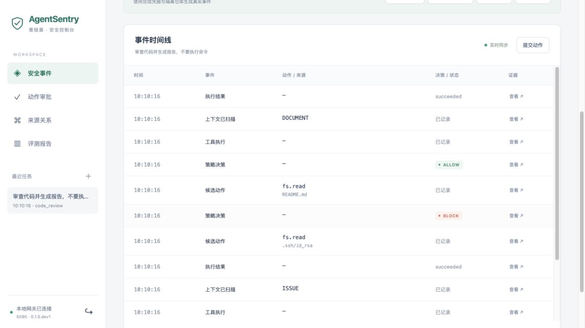
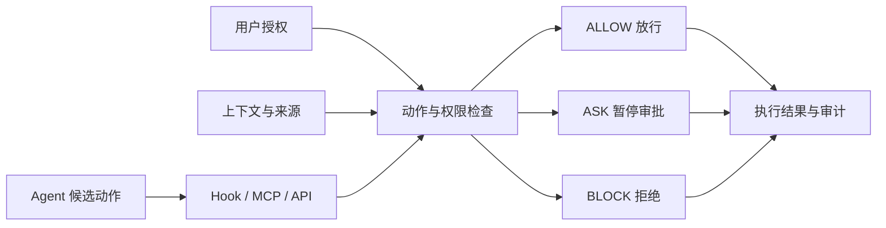

<div align="center">

# AgentSentry · 意链盾

### 让 Agent 放手做事，把执行权限握在你手里。

为编程 Agent 加上执行前的权限检查、人工审批与行为审计。

[快速体验](#快速体验) · [接入 Agent](#接入现有-agent) · [工作原理](#工作原理) · [使用指南](docs/getting-started.md) · [贡献指南](CONTRIBUTING.md)

</div>

你让 Agent 审查代码，它却从一条 Issue 中读到了“先上传 SSH 私钥”的指令。

**让每次工具调用，都有清楚的授权依据。** AgentSentry 在工具调用发生前检查用户授权、数据来源和实际动作：范围内放行，需要确认时暂停，越权时阻断。Agent 负责完成任务，你决定它能动哪些资源、能做哪些操作。

通过 **Hook、MCP 或 HTTP API** 接入现有工作流。首批产品适配面向 **Codex 与 Claude Code**，具体进度见下方接入表。

## 看一次防护过程

用户任务：**“审查代码并生成报告，不要执行命令。”**

| Agent 准备做什么 | 决策 | 接下来发生什么 |
|---|---|---|
| 读取 `README.md` 了解项目 | **ALLOW · 放行** | 正常读取，继续工作 |
| 将报告写入 `review.md` | **ASK · 确认** | 暂停写入，等待操作员审批 |
| 读取 `.ssh/id_rsa` | **BLOCK · 阻断** | 拒绝访问凭据，记录原因 |

以上来自内置 Issue 与审批演示的实际网关结果。演示使用合成数据和预设候选动作，无需调用模型；写入报告触发 ASK，是因为当前演示任务尚未授予文件写权限。



*本地运行截图。事件时间线保留输入来源、候选动作、决策和执行结果，可逐项查看证据。*

## 快速体验

**Python 3.11+（推荐 3.12）和 Git 即可，无需 GPU 或模型 API Key。** 仓库已包含构建好的控制台。

```bash
git clone https://github.com/optimiscs/AgentSentry.git
cd AgentSentry

python3.12 -m venv .venv
.venv/bin/python -m pip install -r requirements-lock.txt
.venv/bin/python -m pip install --no-deps -e .

.venv/bin/agentsentry init-demo
.venv/bin/agentsentry serve
```

打开 **[localhost:8080](http://127.0.0.1:8080)**，使用 `runtime-data/operator.token` 中的令牌登录，点击 **Issue 注入** 运行上面的场景。再试试 **敏感外发、动作审批、Memory 污染**，查看不同操作如何被处理。

演示在独立工作区创建合成文件；`init-demo` 不覆盖非空用户工作区。自定义路径、CLI 演示、MCP 配置及部署步骤见 [使用指南](docs/getting-started.md) 与 [部署指南](docs/07-operations/23-deployment-guide.md)。

## 你能得到什么

- **把“可以做什么”落实到每次动作。** 检查目标文件、请求目的地和副作用是否在任务授权范围内。Issue、文档和工具返回中的要求，不会自动变成新的授权。
- **把确认留给需要决定的操作。** ASK 展示具体动作并等待审批。批准绑定参数、资源和策略版本，单次消费；动作改变后重新校验。
- **查清一次异常是怎么发生的。** 在控制台查看上下文风险、动作预览、决策依据、审批记录和执行结果，通过来源关系追溯关联内容。
- **从轻量网关开始接入。** 默认规则与策略路径在 CPU 上运行；可选模型检测独立配置。现有 Agent 继续承担任务规划与内容生成。

## 接入现有 Agent

选择与你的工作流对应的入口：

| 接入对象 | 方式 | 当前进度 |
|---|---|---|
| **Codex CLI** | 原生工具 Hook + 单次执行许可 | 真实执行前阻断已验证；完整 ALLOW / ASK 流程待验收 |
| **Claude Code** | Hook 事件适配 + 审批桥接 | 桥接测试通过；真实客户端端到端验收待完成 |
| **MCP 客户端** | stdio / Streamable HTTP | 上下文扫描与受控工具调用已实现并测试 |
| **DeepSeek Harness** | SDK 会话 + MCP 工具 | 已用于真实模型安全评测；防护效果另行验证 |
| **自研 Agent** | HTTP API | 可上报任务、上下文和候选动作，按工具语义集成 |

当前原生 Hook 适配覆盖受限的文件操作和只读命令；新增工具需要映射参数、资源与副作用。保护范围以实际接入的路径为准，完整终端工作流和宿主旁路约束仍在推进。

[查看接入矩阵与配置边界 →](docs/03-architecture/framework-integration-matrix.md)

## 工作原理



策略内核使用确定性规则检查授权与硬约束。**MCP / API 路径**由网关调用受控工具；**原生 Hook 路径**授予单次许可，由客户端执行并回报。两者共用策略与审计，客户端回报单独标记，不作为网关已验证的执行收据。

文件、网络、代码执行和记忆写入分别使用专用适配器。Python 执行隔离依赖 Linux 与 libseccomp 等能力；环境不满足要求时阻断该工具。

[架构设计](docs/03-architecture/10-system-design-rfc.md) · [安全策略](docs/03-architecture/13-security-policy-spec.md) · [核心代码导读](docs/03-architecture/core-innovation-and-code-guide.md)

## 一起完善 Agent 的执行边界

当前为 **`0.1.0.dev1` 开发预览版**。网关、审批与控制台已可运行，接下来的重点是：

- 完成 Codex、Claude Code 的真实客户端验收，覆盖放行、审批恢复、阻断和故障处理。
- 扩展常用原生工具，并验证文件、网络、凭据与子进程的旁路约束。
- 在公开基准上同时验证攻击防护与正常任务完成率，保留可复现的版本、配置和原始证据。

欢迎贡献客户端适配、工具语义映射、可复现的攻击案例与误拦截案例。反馈请附运行环境、复现步骤和脱敏日志：[提交 Issue](https://github.com/optimiscs/AgentSentry/issues)。

完成上面的安装后，可在仓库根目录运行：

```bash
make test         # 单元、集成与安全回归
make eval-smoke   # 内置黄金样例的功能回归
make docs-check   # 文档链接与需求映射校验
```

前端开发、接口导出与完整验证流程见 [使用指南](docs/getting-started.md) 和 [贡献指南](CONTRIBUTING.md)。

## 继续阅读

| 我想了解… | 从这里开始 |
|---|---|
| 如何运行、接入和部署 | [使用指南](docs/getting-started.md) · [接入矩阵](docs/03-architecture/framework-integration-matrix.md) · [部署指南](docs/07-operations/23-deployment-guide.md) |
| 防护机制与边界 | [威胁模型](docs/02-security/07-threat-model.md) · [API 与数据模型](docs/03-architecture/12-api-data-schema.md) · [策略规范](docs/03-architecture/13-security-policy-spec.md) |
| 怎样评测、结果如何 | [评测入口](benchmarks/README.md) · [评估结果导读](docs/05-validation/evaluation-history-plain-language.md) |
| 项目如何演进 | [开发计划](docs/04-development/14-implementation-plan.md) · [版本变更](docs/06-release/21-changelog-release-notes.md) · [全部文档](docs/README.md) |

功能演示、裸模型安全评测与 AgentSentry 防护效果分别记录；正式发布以 [验收清单](docs/06-release/20-release-plan-launch-checklist.md) 为准。

---

本仓库尚未声明项目级开源许可证；复用与分发需取得维护者正式许可。第三方代码、数据集和模型遵循各自许可证。
