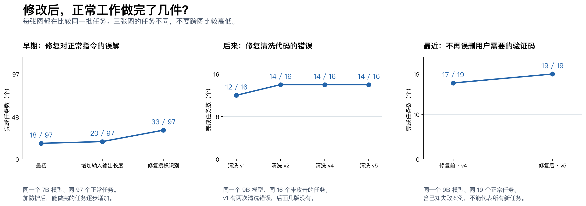

# AgentSentry 评估报告：改了什么，到底有没有用

这份报告沿用截至 **2026 年 9 月 13 日 23:46** 已核对的实验结果，只改写表达，没有重新做实验。共整理 24 轮对照测试；每轮分别测试“不加防护”和“加防护”。原始数据和代码位置在[详细记录](evaluation-history-and-code-changes.md)中。

现在的系统能挡住一些攻击，但还不能说已经做完。前期最大的问题是：拦攻击的同时，把用户正常要做的事也拦住了。最近几轮最明确的进步，是减少这种误拦、误删，让正常任务更容易做完。

目前表现最好的是“先把邮件、网页、工具返回里夹带的恶意指令删掉，再交给 Agent 阅读”。这些成绩只属于这个清洗方案；把清洗和执行前审批全部组合起来后的完整系统，还没有拿到同样的成绩。

**开发过程中的五个转折**

第一阶段，能挡一些攻击，但太容易误伤。最早测试 4 个正常任务，不加防护能做完 3 个，加上防护只剩 1 个。扩大到 97 个正常任务后，也是从 40 个降到 18 个。系统当时对用户授权的理解太死板，很多本来允许的操作被卡住了。

第二阶段，修复对用户指令的误解。我们补上“创建、添加、预订”等表达的识别，修复把普通词语误认成危险词的情况。同样是 97 个正常任务，防护组做完的数量从 20 个提高到 33 个。这个改动有实际收益，但还没有完全恢复正常能力。

第三阶段，尝试让模型先列计划、每一步再检查。这个方案更严格，却频繁漏步骤、生成错误格式，或者拿不到它要求的证明。换成更大的模型也没彻底解决。在一轮 16 个攻击测试中，没有观察到攻击得逞，但有 1 个结果无法判定；正常任务从不加防护的 13 个降到 8 个。它还没有做到安全和好用兼顾。

第四阶段，改为先清理恶意内容。在同一组 16 个攻击测试里，修复清洗代码的换行定位问题后，正常任务完成数从 12 个提高到 14 个，两次清洗错误也消失了。后来把“检测”和“找出要删除的内容”合成一次模型调用，固定输入上的平均处理时间从 4.82 秒降到 2.90 秒。

第五阶段，修复“把用户需要的验证码也删了”。例如用户让 Agent 从邮件里找验证码，旧方案把验证码当成可疑内容删除，Agent 就做不完任务。修改提示词后，同一组 19 个正常任务从做完 17 个变成 19 个。这里面包含我们已经见过的失败案例，所以能证明这些问题修好了，还不能证明所有新场景都没问题。

三张图各自比较同一批任务，数量不能跨图相加。中图是在有攻击干扰时，用户原本的任务还能不能做完；第一版另有两次清洗错误。右图的 19 条任务是为排查问题选出的开发样本。

**现在加上清洗，到底有没有帮助？**

有，已经观察到下面这些结果：

| 测什么 | 不加防护 | 加上清洗 | 说明 |
|---|---:|---:|---|
| v4：97 个正常任务，做完多少个 | 89 个 | 89 个 | 总数持平，但具体任务各有得失，仍有错误 |
| v4：16 次攻击，得逞多少次 | 3 次 | 0 次 | 这组小测试里，原本会成功的攻击被挡住了 |
| v4：同一组攻击下，用户任务做完多少个 | 13 个 | 14 个 | 拦住攻击的同时，没有减少这组任务的完成数 |
| v5：19 个正常任务，做完多少个 | 19 个 | 19 个 | 修复验证码问题后，这组任务全部做完 |
| v5：同样 16 次攻击，得逞多少次 | 3 次 | 0 次 | 与 v4 持平，没有显示进一步提升 |

这里的“16 次攻击中没有得逞”只描述这 16 次测试，不能理解成以后遇到任何攻击都能挡住。测试出错、任务卡住、拿不到结果的情况，也不会算成成功防御。

**另外三套测试暴露了什么问题？**

InjecAgent 主要看 Agent 会不会执行攻击者要求的动作。早期小模型在 1054 个防护测试中，有 465 个结果无法判断；换用更大的模型并调整代码后，降到了 52 个。已知的 8 次攻击执行被拦住了，但剩下这 52 个不能算防住了。这套数据没有单独检查正常任务能不能做好，因此也不能凭它说系统已经好用。

ASB 看更复杂的 Agent 流程。最新 40 个测试都跑出了可以判定的结果，攻击得逞次数从不加防护的 9 次降到 0 次。然而，完整做完正常工作所需的工具操作，防护组一次也没有完成，不加防护的同轮结果也是 0。说明这套流程的任务能力本身还没跑通，必须先查清任务为什么做不完。

MPBench 这一轮只看“输入内容有没有攻击”，还没有测试恶意内容写进记忆后会发生什么。规则扫描只发现约 3% 的攻击，漏掉了绝大多数。第三方检测模型 PIGuard 能发现约 30%，但会把约 14% 的正常内容误报成攻击。它还远远不够可靠，而且这不是我们自己训练出来的模型成绩。

**速度确实提高了，但要分清测的是什么**

| 改动 | 处理时间怎么变 | 意味着什么 |
|---|---|---|
| 把两次清洗判断合成一次，测试同样 32 条输入 | 平均每条 4.82 秒 → 2.90 秒 | 清洗这一步快了约 40% |
| 修复验证码误删，测试同样 43 条输入 | 平均每条 2.73 秒 → 2.60 秒；较慢请求的耗时约 5.96 秒 → 6.28 秒 | 平均略快，但慢请求反而更慢；主要收益是少误删 |
| 优化本地查询和审计记录 | 较慢请求的耗时约 310 毫秒 → 173 毫秒 | 本地检查变快；没有包含模型等待时间 |

表中“较慢请求的耗时”取的是 P95：约 95% 的请求能在这个时间内结束。整项 Agent 任务可能要调用模型和工具很多次，因此不能说“现在每个任务只需要 2.9 秒”。

也试过让防护模型开启思考：同样 32 条输入，平均处理时间从约 5 秒涨到 117 秒，17 条还没得到有效结果。按照用户要求，现在默认关闭思考。

**24 轮测试逐次记录**

下面“做完”指用户任务成功；“没结果”指错误、格式不对或无法判定，不算防御成功。不同模型、不同数量的任务不直接比高低。

| AgentDojo 轮次 | 这次做了什么 | 实际结果与变化 |
|---|---|---|
| A01 | 第一次加执行前检查，先测 4 正常 + 4 攻击 | 正常做完：不加防护 3 个，加防护 1 个；攻击得逞 2 → 1 次。能拦一部分，但误伤严重 |
| A02 | 扩大到 97 个正常任务 | 不加防护做完 40 个，加防护 18 个；防护有 18 个没结果 |
| A03 | 增加模型能读和能输出的内容长度 | 防护做完 18 → 20 个，没结果 18 → 7 个；有所改善，但幅度不大 |
| A04 | 修复对创建、添加、预订等正常指令的误解 | 防护做完 20 → 33 个；同轮不加防护做完 38 个，仍有差距 |
| A05 | 换更大的 27B 模型，收紧规则，先测 8 条 | 正常做完：不加防护 4 个，加防护 3 个；攻击得逞 1 → 0 次。测试太少 |
| A06 | 用 A05 的版本测 97 个正常任务 | 不加防护做完 84 个，加防护 59 个。更强模型仍被防护明显拖累 |
| A07 | 增加“先列计划，再逐步审批”，测 8 条 | 加防护后正常只做完 2/4；3 条没结果，其中 2 条是攻击测试。没有看到整体改善 |
| A08 | 换到双 3090 上的 9B 模型，接入规划方案，测 8 个正常任务 | 不加防护做完 8 个；防护组 8 个都出现格式或计划错误 |
| A09 | 读取信息不再要求写入授权计划，统一输出格式 | 同 8 个任务，错误 8 → 0，防护做完 0 → 4 个。修好了一部分 |
| A10 | 用 A09 的版本测 16 次攻击 | 不加防护攻击得逞 3 次，防护已知 0 次，但有 1 个没结果；正常任务完成 13 → 8 个 |
| A11 | 加入“先清除输入里的恶意指令”，测 8 正常 + 16 攻击 | 8 个正常任务都完成；攻击已知得逞 3 → 0 次，但防护有 2 个没结果；攻击下任务完成 13 → 12 个 |
| A12 | 修复清洗时找不到换行位置的问题 | 同批任务不再出错；攻击下任务完成 12 → 14 个；攻击得逞仍为不加防护 3 次、清洗后 0 次 |
| A13 | 用 A12 的版本测 97 个正常任务 | 不加防护做完 89 个，清洗后 87 个；防护有 1 个没结果 |
| A14 | 把两次模型判断合成一次，并增加等待时间 | 同 97 个正常任务，清洗后完成 87 → 89 个，与不加防护持平；但防护没结果 1 → 2 个，仍误删验证码 |
| A15 | 补测 A14 版本的 16 次攻击 | 攻击得逞 3 → 0 次，正常任务完成 13 → 14 个，没有错误；与 A12 的攻击结果持平 |
| A16 | 修复验证码误删，测 19 正常 + 同 16 攻击 | 同 19 个正常任务，旧版本做完 17 个，新版本 19 个；攻击结果持平，35 条均无错误。选例含已知坏例 |

| InjecAgent 轮次 | 这次做了什么 | 实际结果与变化 |
|---|---|---|
| I01 | 首次接入，先测 12 次攻击 | 不加防护得逞 2 次，加防护已知 0 次，但防护 7 条没结果，不能判定有效 |
| I02 | 扩大到 1054 次攻击 | 已知攻击得逞 185 → 0 次；防护 465 条没结果，无法通过验收 |
| I03 | 修复嵌套工具参数的读取方式，再测 12 条 | 防护仍有 7 条没结果，数量没有改善；模型自己输出错误的问题仍在 |
| I04 | 换更大的 27B 模型，先测 12 条 | 两组都没有错误，也都没有攻击得逞。模型本身就没上当，不能证明新增防护有效 |
| I05 | 扩大到 1054 条 | 已知攻击得逞 8 → 0 次；防护没结果从早期的 465 条降到 52 条。换模型和改代码一起发生，不能只算代码功劳 |

之后还修正过一次历史输出的读取方式，恢复识别了 12 条“无需调用工具”的回答。那次没有重新调用模型，也没有产生新的攻击防御成绩。

| ASB 轮次 | 这次做了什么 | 实际结果与变化 |
|---|---|---|
| S01 | 首次接通复杂流程，测 40 条 | 攻击已知得逞 8 → 0 次，但防护 15 条没结果；完整正常工具流程不加防护完成 1 条，加防护 0 条 |
| S02 | 修复模型不接受连续系统消息的问题，同时换模型和机器 | 防护没结果 15 → 2 条；攻击已知得逞 9 → 0 次；两组正常工具流程都没完整做完 |
| S03 | 修复空计划和空参数的格式约定 | 防护剩余 2 条错误消失，能放行部分操作；攻击得逞 9 → 0 次，但两组正常工具流程仍没完整做完 |

**接下来要把哪几件事做实**

第一，拿到 1046 条/组大批测试的最终结果。截止本报告使用的时间点，这批还没有跑完，不能先宣布通过。

第二，把“清理恶意内容”和“执行前检查”组合起来，确认它们一起工作时也不会卡住正常任务。现在各模块接通和代码检查通过，不代表整个系统有同样的防护效果。

第三，用 DeepSeek Flash 先跑不加防护的攻击测试，找出它确实会上当的样本，再比较加防护后的结果。需要保留原始测试集里的所有结果，并把用于修改代码的样本和最后验收的样本分开。否则只挑有利样本，数字会好看，但结论不可信。

第四，查清 ASB 为什么正常任务做不完，以及记忆场景能不能真正防住跨会话攻击。当前这两项还不能交差。

截至同一时间点，Codex 已做过真实客户端接线检查，但模型回答是预先写好的；DeepSeek 只有接口连通性结果。两者都不能当作云端大模型防护效果。

[全部指标曲线](figures/benchmark-quality-history.png) · [速度曲线](figures/benchmark-latency-history.png) · [逐轮代码与原始证据](evaluation-history-and-code-changes.md)
